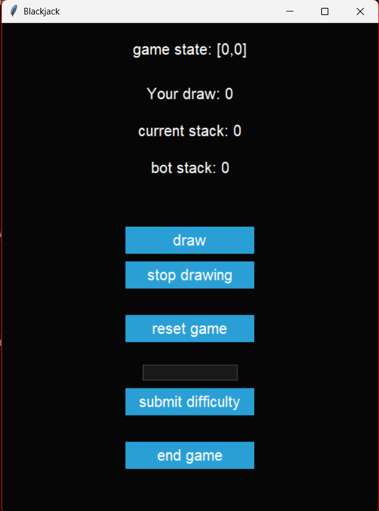

# Description
A desktop Blackjack-like application. Instead of using a simple bot with static if-else branches as an opponent, the app uses the knn-classifier algorithm with three stages, spanning from easy to hard. For each level of difficulty, the classifier gets different data in order to achieve a mix of offensive and defensive behaviour. The graphical user interface is styled basic to enhance usability.

## Usage
* Download the blackjack.exe in `blackjack/src/dist/` and run it. Depending on your current system, this might take some seconds. **This may lead to a conflict with antivirus software!!**
 or 
* Download the src-folder and run `py -m blackjack_v2_oop.py` in a command terminal inside the src folder
 or 
* click on this link for using it as a web-app: `https://blackjack-267ffbsdlf6hqeymwvhamq.streamlit.app/`

## Libraries used
* random
* tkinter
* scikit-learn (sklearn)
* numpy
* pandas

## How to play
After the app opened, it is highly recommended to first set the difficulty. To set, write `easy`,`medium` or `hard` and click "submit difficulty". The default is medium if nothing was manually set. If something else was set, it will fail to load the difficulty and the default is used for every round. For playing, first draw 'cards'. If you think your stack is high enough, click "stop drawing" and the bot will automatically draw its cards. The result will be shown right after. Click "reset" to play another round and click "end game" to close the app.

## Roadmap
* v1: only functional version
* v2: recoding the app with classes for reusability, outsourcing the training data into three seperate files
* v3: replacing the scikit-learn classifier with a custom knn build from scratch
* v4: redesigning the gui for even better user experience